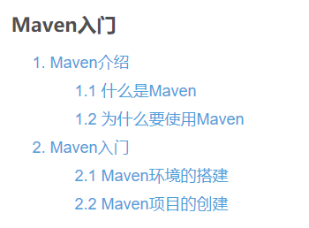
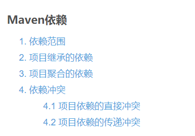

# studyMaven
study maven
## 1. Maven入门
[Maven入门](https://blog.csdn.net/a18792721831/article/details/109134235)  
  

## 2. [INFO] Generating project in Batch mode
[[INFO] Generating project in Batch mode](https://blog.csdn.net/a18792721831/article/details/109134504)  

## 3. Maven项目的目录结构
[Maven项目的目录结构](https://blog.csdn.net/a18792721831/article/details/109339923)  

## 4. Maven仓库解析
[Maven仓库解析](https://blog.csdn.net/a18792721831/article/details/109339948)  
  

## 5. Maven pom.xml解析
[Maven pom.xml解析](https://blog.csdn.net/a18792721831/article/details/109339992)  

## 6. MVN命令与生命周期
[MVN命令与生命周期](https://blog.csdn.net/a18792721831/article/details/109403197)  

## 7. Maven私有仓库的搭建和使用
[Maven私有仓库的搭建和使用](https://blog.csdn.net/a18792721831/article/details/109403250)  

## 8. Maven依赖
[Maven依赖](https://blog.csdn.net/a18792721831/article/details/109403309)  

## 9. Maven最全知识
[Maven最全知识](https://blog.csdn.net/a18792721831/article/details/109403359)